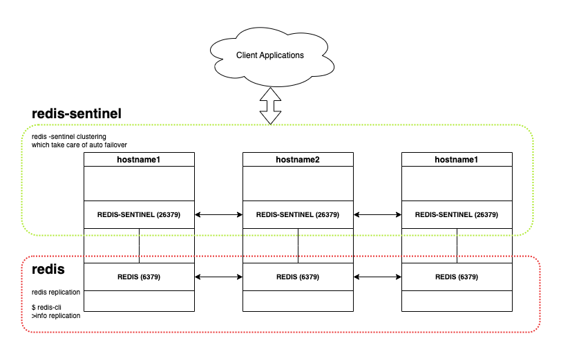

# Redis Replication with Sentinel - High Availability

_redis [5.0.3] | choose higher version if you like_

## redis sentinel - these setups help

1. Redis Installation [skip if already installed]
2. Hostname Resolution Setup [or we can skip this by IP address]
3. Redis Master-Slave Replica
4. Redis Sentinel - auto failover



### 1. Redis Installation

---

_Here we are refering the linux machine to install redis. To install [refer here](https://redis.io/docs/getting-started/installation/) or below command on terminal to install_

```
yum -y install redis
```

_if linux machine has firewall service running, we need to enable redis ports by running below command_

```
firewall-cmd --permanent --add-port={6379,26379}/tcp
firewall-cmd --reload
```

_now, let's run redis as a service on linux, and verify the service status_

```
systemctl enable redis
systemctl start redis
systemctl status redis
```

_**REPEAT** the step in Each & Every machine_

### 2. Hostname Resolution Setup

---

_We are setting up redis with 3 linux machine, here we are the ips and their hostname reference as, modify as per your structure_

_Now, let's add hosts as known host for the machine, login to hostname1 machine and run the below command_

```
cat >> /etc/hosts <<EOF
192.168.1.101 hostname1
192.168.1.102 hostname2
192.168.1.103 hostname3
EOF

cat /etc/hosts
```

_**REPEAT** the step in **Each & Every** machine_

### 3. Redis Master-Slave Replica

---

_Here, we are setting up redis master-slave with [replication](https://redis.io/docs/management/replication/), to start the replication, we need to setup redis.conf file in master and slave node seperately_

#### 3.1. Redis-Master Configuration

_[linux](https://redis.io/docs/management/config/): /etc/redis.conf_

_Modify below configuration variable for master node, we are refering hostname1 as master node_

```
# ...
bind 127.0.0.1 hostname1
# ...
appendonly yes
# ...
appendfsync everysec
# ...
```

_now, restart the service by running_

```
systemctl restart redis
```

#### 3.2. Redis-Slave Configuration

_[linux](https://redis.io/docs/management/config/): /etc/redis.conf_

_Modify below configuration variable for slave node, we are refering hostname2 and hostname3 as slave node_

_**NOTE:** only two additional parameter are there in slave node - **replicaof** and **replica-priority**, parameter replica-priority should be set between 1 < x < 100 because master node has priority=100 as default_

```
# ...
bind 127.0.0.1 hostname2
# ...
appendonly yes
# ...
appendfsync everysec
# ...
replicaof hostname1 6379    # master node hostname(ip) and port
# ...
replica-priority 90
# ...
```

_now, restart the service by running_

```
systemctl restart redis
```

_**REPEAT** the step in both slave node_

_after completing the master-slave configuration redis replications is ready, to verify, login into redis master as_

```
redis-cli

127.0.0.1:6379> info replication
#
#    # Replication
#    role:master            # redis node role -> master
#    connected_slaves:2     # redis slaves count -> here we have 2 slaves with 1 master
#
#
```

### 4. Redis Sentinel - auto failover

---

_Sentinel helps to setup clustering between nodes and does the auto failover if master node fails_

_while installing redis, redis-sentinel service auto installed_

_Modify below configuration variable for sentinel node, we are refering hostname1_

_[linux](https://redis.io/docs/management/config/): /etc/redis-sentinel.conf_

```
#
port 26379
# ...
dir "/var/lib/redis/sentinel"                   # modify as you like
# ...
sentinel monitor mymaster hostname1 6379 2      # master redis configuration
# ...
# sentinel auth-pass mymaster Infra0n
# ...
sentinel down-after-milliseconds mymaster 10000
# ...
sentinel parallel-syncs mymaster 1
# ...
sentinel failover-timeout mymaster 20000
# ...
```

_now, restart the service by running_

```
systemctl enable redis-sentinel
systemctl restart redis-sentinel
systemctl status redis-sentinel
```

_**REPEAT** the step in **Each & Every** machine_

_completed :)_

### ADDITIONAL

---

#### A. How to connect with redis-cluster

_To connect with redis, we need to connect with redis-sentinel cluster, is our scenarios our sentinel cluster as_

`hostname1:26379,hostname2:26379,hostname2:26379`

#### B. How to run redis cluster with docker compose

_**prerequisites**_

- Docker should be running
- Docker-compose should be installed

_navigate to the path of **docker-compose.yml**, and the command as_

```
docker-compose up --build --force
```
